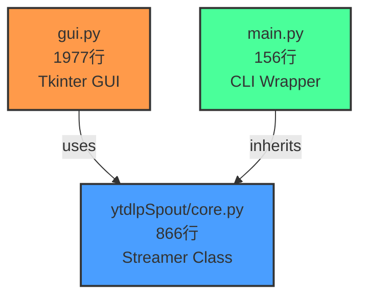

# ytdlpSpout 機能比較表

## アーキテクチャ概要

ytdlpSpoutは3層構造で設計されています:

### 各コンポーネントの役割

- **`core.py`**: YouTube/ローカル動画のストリーミング、Spout送信、シーク、PTS同期などの**コア機能**を提供
- **`gui.py`**: Tkinterベースのグラフィカルインターフェース、動画切り替え、ダウンロード管理などの**高度な機能**を実装
- **`main.py`**: コマンドライン引数を解析し、`core.py`の機能を**シンプルに**公開

---

## 機能マトリクス

| 機能カテゴリ | 機能 | core.py | CLI版 | GUI版 | 備考 |
|------------|------|---------|-------|-------|------|
| **基本ストリーミング** | YouTube URL再生 | ✅ | ✅ | ✅ | |
| | ローカルファイル再生 | ✅ | ✅ | ✅ | |
| | ライブストリーム対応 | ✅ | ✅ | ✅ | |
| | VOD（録画）再生 | ✅ | ✅ | ✅ | |
| | ループ再生 | ✅ | ✅ | ✅ | `--loop` / UIチェックボックス |
| **解像度制御** | 自動解像度検出 | ✅ | ✅ | ✅ | |
| | 最大解像度制限 | ✅ | ✅ | ✅ | `--max-width/height` / UI入力 |
| | 手動解像度設定 | ✅ | ✅ | ✅ | `-w/--width --height` / UI入力 |
| | 解像度制限無効化 | ✅ | ✅ | ✅ | `--no-limit` / UIチェックボックス |
| **Spout送信** | 基本Spout送信 | ✅ | ✅ | ✅ | |
| | 送信者名カスタマイズ | ✅ | ✅ | ✅ | `-s/--sender` / UI入力 |
| | Spout送信ON/OFF制御 | ✅ | ❌ | ✅ | GUI専用（動画切り替え時に使用） |
| **再生制御** | 基本的なシーク | ✅ | ❌ | ✅ | CLIは起動時のみ、GUIは動的シーク可能 |
| | PTS（タイムスタンプ）同期 | ✅ | ❌ | ✅ | 動画切り替え時のフレーム精度同期 |
| | 指定PTSでの一時停止 | ✅ | ❌ | ✅ | `pause_at_pts()` / GUI専用 |
| | 一時停止解除 | ✅ | ❌ | ✅ | `resume()` / GUI専用 |
| | PTS待機 | ✅ | ❌ | ✅ | `wait_for_pts()` / GUI専用 |
| **動画管理** | 動画切り替え | ❌ | ❌ | ✅ | GUI専用（シームレス切り替え） |
| | ダウンロード機能 | ❌ | ❌ | ✅ | GUI専用（yt-dlp経由） |
| | 一時ファイル管理 | ❌ | ❌ | ✅ | GUI専用（ダウンロード後のクリーンアップ） |
| | プレイリストURL正規化 | ❌ | ❌ | ✅ | `clean_playlist_url()` / GUI専用 |
| **UI/UX** | リアルタイムプレビュー | ❌ | ❌ | ✅ | GUI専用 |
| | シークバー | ❌ | ❌ | ✅ | GUI専用（状態表示色分け） |
| | ダウンロード進捗表示 | ❌ | ❌ | ✅ | GUI専用 |
| | ログ表示 | ❌ | ❌ | ✅ | GUI専用（カスタムロガー） |
| | パラメータ保存/復元 | ❌ | ❌ | ✅ | GUI専用（設定永続化） |
| **デバッグ/診断** | 詳細ログ出力 | ✅ | ✅ | ✅ | `-v/--verbose` / UIチェックボックス |
| | コーデック対応確認 | ✅ | ✅ | ❌ | `--check-codecs` / CLIのみ |
| | フレーム送信監視 | ✅ | ❌ | ✅ | GUI専用（送信状態トラッキング） |

### 凡例
- ✅ **実装済み**: 機能が利用可能
- ❌ **未実装**: 機能が利用不可
- **core.py**: `Streamer`クラスに実装されている機能
- **CLI版**: コマンドライン引数で利用可能な機能
- **GUI版**: GUIインターフェースで利用可能な機能

---

## 設計思想

### CLI版の位置づけ
CLI版は**意図的にシンプル**に保たれています:
- 起動時にパラメータを指定して実行する「ワンショット」ツール
- 複雑なUI制御や動的な動画切り替えは不要
- システム統合やスクリプト化に適した設計

### GUI版の位置づけ
GUI版は**インタラクティブな操作**に最適化されています:
- リアルタイムでのパラメータ変更
- 動画の動的切り替え（ライブ配信中の素材変更など）
- ダウンロード管理とプレビュー機能
- 視覚的なフィードバック（進捗、ログ、プレビュー）

### core.pyの役割
`core.py`の`Streamer`クラスは**両方の基盤**として機能:
- ストリーミングの核となるロジックを集約
- GUI/CLI両方から利用可能な共通機能を提供
- 新機能は原則として`core.py`に実装し、GUI/CLIから呼び出す

---

## 使い分けガイド

### CLI版を使うべき場合
- スクリプトやバッチ処理での自動化
- サーバー環境でのヘッドレス実行
- シンプルな起動パラメータで完結する用途
- システムサービスとしての常駐

### GUI版を使うべき場合
- リアルタイムでの動画切り替えが必要
- ダウンロード機能を使いたい
- 視覚的なフィードバックが欲しい
- パラメータを試行錯誤しながら調整したい

---

## 今後の拡張方針

### CLI版への機能追加候補
現時点では追加予定なし。CLI版は「シンプルさ」を維持する方針。

必要に応じて以下を検討可能:
- `--download` オプション（ダウンロード専用モード）
- 対話的なREPLモード（動画切り替えやシーク操作）

### core.pyの拡張
新機能は原則として`core.py`に実装し、GUI/CLI両方から利用可能にする:
- ✅ PTS同期機能（実装済み）
- ✅ Spout送信制御（実装済み）
- ✅ 一時停止/再開機能（実装済み）

### GUI版の拡張
- プレイリスト管理機能
- 複数動画のキューイング
- エフェクト/トランジション機能

---

## 技術的な補足

### PTS（Presentation Timestamp）同期
GUI版で実装されている高度な機能:
- フレーム単位での正確な同期を実現
- 動画切り替え時のシームレスな遷移
- `wait_for_pts()`, `pause_at_pts()`, `resume()` メソッドで制御

### Spout送信制御
動画切り替え時に一時的にSpout送信を無効化:
- 古い動画のフレームが送信されるのを防ぐ
- 新しい動画の準備が完了してから送信再開
- `set_spout_enabled(bool)` メソッドで制御

### ダウンロード機能
GUI版専用の機能:
- yt-dlpを使った動画ダウンロード
- 進捗表示とキャンセル対応
- ダウンロード完了後の自動切り替え
- 一時ファイルの自動クリーンアップ

---

## 更新履歴

- **2025-12-22**: 初版作成（GUI版とCLI版の機能差分を文書化）
