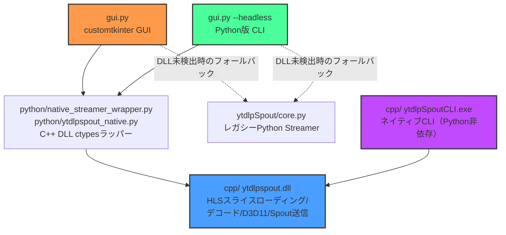

# ytdlpSpout 機能比較表

## アーキテクチャ概要

ytdlpSpout は現在、C++ ネイティブバックエンドを中核として、Python 側から利用する構成です:

### 各コンポーネントの役割

- **`cpp/`（ytdlpspout.dll / ytdlpSpoutCLI.exe）**: HLS スライスローディング、FFmpeg デコード、D3D11 ハードウェアアクセラレーション、Spout 送信を行う**コアエンジン**。GUI・Python版CLI・ネイティブCLI いずれからも共通で使われる（ネイティブCLIは DLL 相当のロジックを直接実行ファイルとしてビルドしたもの）。
- **`gui.py`**: customtkinter ベースの GUI。動画切り替え、ダウンロード管理などの高度な機能を実装。同じスクリプトが `--headless` 指定でヘッドレス（CLI）モードにもなる。
- **`python/native_streamer_wrapper.py` / `python/ytdlpspout_native.py`**: C++ DLL を ctypes 経由で呼び出し、レガシー `Streamer` 互換の API として GUI/CLI に提供する。C++ DLL が見つかる環境では常にこちらが使われる。
- **`ytdlpSpout/core.py`**: 旧・Python 実装の `Streamer`。C++ DLL が利用できない環境向けのフォールバックとして残っている。
- **`cpp/src/main.cpp`（ytdlpSpoutCLI.exe）**: Python を介さずに動作するネイティブ CLI。常駐・軽量起動が必要な用途向け。

---

## 機能マトリクス（GUI版 / Python版CLI）

| 機能カテゴリ | 機能 | GUI版 | Python版CLI（`gui.py --headless`） | 備考 |
|------------|------|-------|-----------------------------------|------|
| **基本ストリーミング** | URL再生（YouTube/ニコニコ等） | ✅ | ✅ | |
| | ローカルファイル再生 | ✅ | ✅ | |
| | ライブ配信・HLS対応 | ✅ | ✅ | C++バックエンドのスライスローディング |
| | ループ再生 | ✅ | ✅ | UIチェックボックス / `--loop` |
| **解像度制御** | 自動解像度検出 | ✅ | ✅ | |
| | 最大解像度制限 | ✅ | ✅ | UI入力 / `--max-width/--max-height` |
| | 手動解像度設定 | ✅ | ✅ | UI入力 / `-w/--width --height` |
| | 解像度制限無効化 | ✅ | ✅ | UIチェックボックス / `--no-limit` |
| **Spout送信** | 基本Spout送信 | ✅ | ✅ | |
| | 送信者名カスタマイズ | ✅ | ✅ | UI入力 / `-s/--sender` |
| | Spout送信ON/OFF制御 | ✅ | ❌ | GUI専用（動画切り替え時に使用） |
| **再生制御** | 起動時シーク | ✅ | ❌ | GUIは動的シーク可能、CLIは起動パラメータのみ |
| | PTS（タイムスタンプ）同期 | ✅ | ❌ | 動画切り替え時のフレーム精度同期 |
| **動画管理** | 動画切り替え | ✅ | ❌ | GUI専用（シームレス切り替え） |
| | ダウンロード機能 | ✅ | ❌ | GUI専用（yt-dlp経由） |
| **UI/UX** | リアルタイムプレビュー・シークバー・ログ表示 | ✅ | ❌ | GUI専用 |
| **デバッグ/診断** | 詳細ログ出力 | ✅ | ✅ | UIチェックボックス / `-v/--verbose` |
| | コーデック対応確認 | ❌ | ✅ | `--check-codecs` |

### 凡例
- ✅ **実装済み**: 機能が利用可能
- ❌ **未実装**: 機能が利用不可

---

## ネイティブCLI（`ytdlpSpoutCLI.exe`）について

Python を経由しない別実装で、`cpp/src/main.cpp` がエントリーポイントです。用意されているオプションはシンプルです（詳細は `ytdlpSpoutCLI.exe --help` または `cpp/src/main.cpp` を参照）:

- `-n, --name <name>`: Spout送信者名
- `-l, --loop`: ループ再生
- `-v, --verbose`: 詳細ログ
- `-f, --format <fmt>`: フォーマット選択（例: "best", "1080p"）
- `--height <pixels>`: 優先する動画の高さ
- `--ytdlp-path <path>`: yt-dlp実行ファイルのパス
- `--no-hwaccel`: ハードウェアアクセラレーション無効化
- `--no-progress`: 進捗表示無効化

Python版CLI（`gui.py --headless`）にある `--max-width/--max-height`、`--check-codecs`、ダウンロード機能などは現時点では持ちません。起動が速く依存が少ないため、常駐・単純なワンショット配信に向いています。

---

## 設計思想

### GUI版の位置づけ
GUI版は**インタラクティブな操作**に最適化されています:
- リアルタイムでのパラメータ変更
- 動画の動的切り替え（ライブ配信中の素材変更など）
- ダウンロード管理とプレビュー機能
- 視覚的なフィードバック（進捗、ログ、プレビュー）

### CLI版（Python版・ネイティブ版共通）の位置づけ
- 起動時にパラメータを指定して実行する「ワンショット」ツール
- 複雑なUI制御や動的な動画切り替えは不要
- システム統合やスクリプト化に適した設計
- ネイティブ版はさらに、Python/DLLロードのオーバーヘッドを避けたい用途向け

### C++バックエンドの役割
`cpp/` の C++ 実装が**両方の基盤**として機能:
- HLSスライスローディング、デコード、D3D11ハードウェアアクセラレーション、Spout送信の核となるロジックを集約
- GUI/Python版CLI（DLL経由）・ネイティブCLI（直接実行）の両方から利用可能
- 新機能は原則としてC++側に実装し、Python/ネイティブCLI双方から利用可能にする

---

## 使い分けガイド

### GUI版を使うべき場合
- リアルタイムでの動画切り替えが必要
- ダウンロード機能を使いたい
- 視覚的なフィードバックが欲しい
- パラメータを試行錯誤しながら調整したい

### Python版CLI（`gui.py --headless`）を使うべき場合
- `--max-width/--max-height` や `--check-codecs` など、やや高度なオプションが必要
- Python環境が既にセットアップ済みで、追加の実行ファイル管理を避けたい

### ネイティブCLI（`ytdlpSpoutCLI.exe`）を使うべき場合
- スクリプトやバッチ処理での自動化
- サーバー環境でのヘッドレス実行、システムサービスとしての常駐
- Python非依存で軽量に起動したい

---

## 技術的な補足

### PTS（Presentation Timestamp）同期
GUI版で実装されている高度な機能:
- フレーム単位での正確な同期を実現
- 動画切り替え時のシームレスな遷移
- `wait_for_pts()`, `pause_at_pts()`, `resume()` メソッドで制御（`python/native_streamer_wrapper.py`）

### Spout送信制御
動画切り替え時に一時的にSpout送信を無効化:
- 古い動画のフレームが送信されるのを防ぐ
- 新しい動画の準備が完了してから送信再開
- `set_spout_enabled(bool)` メソッドで制御

### ラップトップ・省電力環境でのSpout
ラップトップでSpoutが表示されない・不安定な場合は、省電力により内蔵GPUが選ばれている可能性があります。本アプリは可能な場合に高パフォーマンスGPUを自動選択します（DXGI 1.6、Windows 10 April 2018 Update 以降）。それでも不具合がある場合は、電源オプションを「高パフォーマンス」にするか、NVIDIA/AMDのコントロールパネルで当アプリを「高パフォーマンスGPU」に指定してください。

### ダウンロード機能
GUI版専用の機能:
- yt-dlpを使った動画ダウンロード
- 進捗表示とキャンセル対応
- ダウンロード完了後の自動切り替え
- 一時ファイルの自動クリーンアップ

---

## 更新履歴

- **2025-12-22**: 初版作成（GUI版とCLI版の機能差分を文書化）
- **2026-07-07**: C++ ネイティブバックエンドへの移行を反映（`main.py` 廃止、C++ DLL/ネイティブCLIを中心とした構成に更新）
