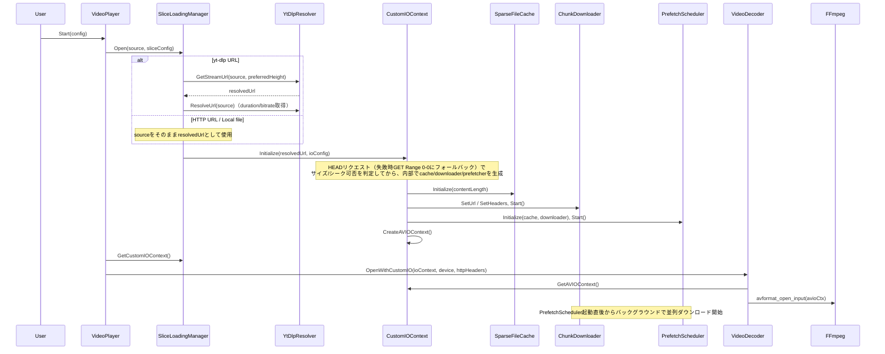
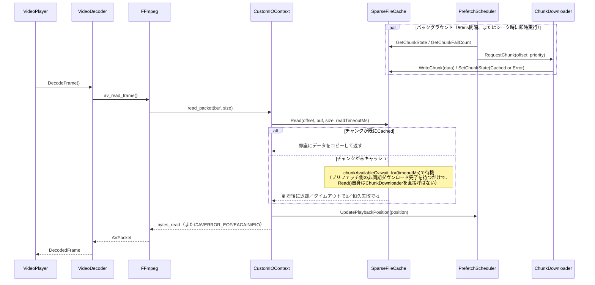

# スライス読み込みアーキテクチャ設計書

## 概要

スライス読み込み（Slice Loading）は、ストリーミング再生とダウンロード再生の折衷案として設計された手法です。

### 目標
- **即時再生**: ストリーミングのように即座に再生開始
- **完全キャッシュ**: ダウンロードのように全チャンクを保存
- **シームレス**: URL→ローカルの切り替えを廃止（常にスライス読み込み）

### 現在の問題点（シームレス切り替え方式）
```
URLストリーミング → バックグラウンドダウンロード → シームレス切り替え
```
- 2つの再生パスを維持する複雑さ
- 切り替え時の同期処理が必要
- FPSの不安定さ（8.6fps→32.6fps→25fps）

### スライス読み込み方式
```
URL解決 → スライス読み込み（CustomIOContext） → 単一再生パス
```
- 再生開始時から全て同じパス
- チャンクが揃えばローカルファイルと同等
- 切り替え不要

---

## コンポーネント構成

```
┌─────────────────────────────────────────────────────────────────────────────┐
│                              VideoPlayer                                      │
│  ┌─────────────────────────────────────────────────────────────────────────┐│
│  │                     SliceLoadingManager                                  ││
│  │  ┌───────────────┐  ┌──────────────────┐  ┌────────────────────────┐   ││
│  │  │ YtDlpResolver │  │ CustomIOContext  │  │ VideoDecoder (FFmpeg)  │   ││
│  │  │               │→ │                  │→ │                        │   ││
│  │  │ URL→Stream    │  │ AVIO Callbacks   │  │ HW Decode (D3D11VA)    │   ││
│  │  └───────────────┘  └────────┬─────────┘  └────────────────────────┘   ││
│  │                              │ （内部で生成・所有）                     ││
│  │                     ┌────────▼─────────┐                               ││
│  │                     │  SparseFileCache │                               ││
│  │                     │  ┌─────────────┐ │                               ││
│  │                     │  │ Chunk 0     │ │                               ││
│  │                     │  │ Chunk 1     │ │                               ││
│  │                     │  │ Chunk 2     │ │                               ││
│  │                     │  │ ...         │ │                               ││
│  │                     │  └─────────────┘ │                               ││
│  │                     └────────┬─────────┘                               ││
│  │                              │                                          ││
│  │  ┌───────────────────────────┼────────────────────────────────────┐    ││
│  │  │       CustomIOContextが内部で生成・所有する                      │    ││
│  │  │ ┌─────────────────────────▼────────────────────────────────┐  │    ││
│  │  │ │                   ChunkDownloader                        │  │    ││
│  │  │ │  ┌─────────┐ ┌─────────┐ ┌─────────┐ ┌─────────┐        │  │    ││
│  │  │ │  │Worker 0 │ │Worker 1 │ │Worker 2 │ │  ...    │        │  │    ││
│  │  │ │  └────┬────┘ └────┬────┘ └────┬────┘ └────┬────┘        │  │    ││
│  │  │ │       └───────────┴───────────┴───────────┘              │  │    ││
│  │  │ │                       ↓ （単一queueMutex + queueCvで保護）│  │    ││
│  │  │ │              Priority Queue                              │  │    ││
│  │  │ │  [Critical] → [High] → [Medium] → [Low]                  │  │    ││
│  │  │ └──────────────────────────────────────────────────────────┘  │    ││
│  │  │        （ワーカー数はmaxConcurrentDownloadsで指定、既定6）       │    ││
│  │  │ ┌──────────────────────────────────────────────────────────┐  │    ││
│  │  │ │                  PrefetchScheduler                       │  │    ││
│  │  │ │  50ms間隔のバックグラウンドスレッドがTriggerPrefetch()を実行 │  │    ││
│  │  │ │  （NotifySeek時は即座にも実行）                            │  │    ││
│  │  │ └──────────────────────────────────────────────────────────┘  │    ││
│  │  └────────────────────────────────────────────────────────────────┘    ││
│  └─────────────────────────────────────────────────────────────────────────┘│
│                                                                              │
│  ┌─────────────────────────────────────────────────────────────────────────┐│
│  │                         Graphics Pipeline                                ││
│  │  FrameConverter → TexturePool → SpoutSender → VJ Software               ││
│  └─────────────────────────────────────────────────────────────────────────┘│
└─────────────────────────────────────────────────────────────────────────────┘
```

**実際の所有関係（重要）**: `SliceLoadingManager` (`cpp/src/io/SliceLoadingManager.h/cpp`) は `CustomIOContext` の `unique_ptr` だけを保持し、`SparseFileCache` / `ChunkDownloader` / `PrefetchScheduler` を直接は持たない。これら3つは `CustomIOContext::InitializeHttp()` (`cpp/src/io/CustomIOContext.cpp:188-293`) が内部で生成・起動する。上図はデータフローの理解のために並べて描いているが、クラス階層としては `SliceLoadingManager → CustomIOContext → {SparseFileCache, ChunkDownloader, PrefetchScheduler, HttpClient}` である。

---

## 既存コンポーネントの状態

### ✅ 実装済み + 統合済み
| コンポーネント | ファイル | 状態 |
|---------------|---------|------|
| CustomIOContext | `cpp/src/io/CustomIOContext.h/cpp` | 実装済み |
| SparseFileCache | `cpp/src/io/SparseFileCache.h/cpp` | 実装済み |
| ChunkDownloader | `cpp/src/io/ChunkDownloader.h/cpp` | 実装済み |
| PrefetchScheduler | `cpp/src/io/PrefetchScheduler.h/cpp` | 実装済み |
| YtDlpResolver | `cpp/src/ytdlp/YtDlpResolver.h/cpp` | 実装済み |
| VideoDecoder | `cpp/src/decoder/VideoDecoder.h/cpp` | 実装済み |
| VideoPlayer | `cpp/src/player/VideoPlayer.h/cpp` | 実装済み |
| SliceLoadingManager | `cpp/src/io/SliceLoadingManager.h/cpp` | 実装済み |
| VideoDecoder + CustomIOContext | `cpp/src/decoder/VideoDecoder.cpp` | **統合済み (Phase 1)** |
| VideoPlayer + SliceLoadingManager | `cpp/src/player/VideoPlayer.cpp` | **統合済み (Phase 2)** |
| C API 拡張 | `cpp/src/bindings/c_api.cpp` | **統合済み (Phase 3)** |
| Python GUI 統合 | `python/ytdlpspout_native.py` | **統合済み (Phase 4)** |
| M3U8Parser | `cpp/src/hls/M3U8Parser.h/cpp` | 実装済み |
| AesCbcDecryptor | `cpp/src/hls/AesCbcDecryptor.h/cpp` | 実装済み |
| HlsSegmentCache | `cpp/src/hls/HlsSegmentCache.h/cpp` | 実装済み |
| HlsCustomAVIOContext | `cpp/src/hls/HlsCustomAVIOContext.h/cpp` | 実装済み |
| HlsSliceLoadingManager | `cpp/src/hls/HlsSliceLoadingManager.h/cpp` | 実装済み |
| VideoPlayer + HlsSliceLoadingManager | `cpp/src/player/VideoPlayer.cpp` | **統合済み (Phase 6)** |
| VideoDecoder + AVIOContext | `cpp/src/decoder/VideoDecoder.cpp` | **追加: OpenWithAVIOContext()** |

### 完了済み
- ✅ 全フェーズ統合完了
- ⚠️ ただし「キャッシュ永続化（ファイル保存）」は未実装（後述のセクション参照）。設定フィールド（`cachePath`）だけが存在し、実際のファイル書き込みコードは無い。

---

## 統合設計

### 1. PlayerConfig拡張

実際の定義は `cpp/src/player/VideoPlayer.h:31-74`。

```cpp
/// @brief プレイヤー設定
struct PlayerConfig {
    // === 入力ソース ===
    std::string source;                     // ファイルパス or URL（推奨）
    std::string filePath;                   // 入力ファイルパス（後方互換性のため維持、sourceが優先）

    // === 出力設定 ===
    std::string senderName = "ytdlpSpout";  // Spout Sender名
    int outputWidth = 0;                    // 0=ソース解像度
    int outputHeight = 0;

    // === 再生設定 ===
    bool loop = false;
    bool useHardwareAccel = true;
    bool verbose = false;

    // === スライス読み込み設定 ===
    struct SliceConfig {
        bool enabled = true;
        size_t chunkSize = 2 * 1024 * 1024;         // 2MB
        size_t maxCacheMemory = 256 * 1024 * 1024;  // 256MB
        int maxConcurrentDownloads = 6;
        int prefetchChunksAhead = 24;               // 48MB分
        int criticalChunksAhead = 6;                // 即座にダウンロードする範囲
        bool enableContinuousDownload = true;
        std::string cachePath;                      // 現状未使用（後述のセクション参照）
    } slice;

    // === yt-dlp設定 ===
    struct YtDlpConfig {
        std::string path;                   // 空=自動検出
        int preferredHeight = 1080;
    } ytdlp;

    // === HTTPヘッダー設定 ===
    std::map<std::string, std::string> httpHeaders;  // Cookie等

    // === HLS判定ヒント ===
    int isHlsHint = -1;  // -1=自動判定、0=非HLS、1=HLS（yt-dlp側の判定結果を伝搬）

    const std::string& GetSource() const {
        return source.empty() ? filePath : source;
    }
};
```

これらのデフォルト値は `cpp/src/bindings/c_api.cpp` の `ytdlpspout_config_ex_init()`（chunkSize=2MB, maxCacheMemory=256MB, maxConcurrentDownloads=6, prefetchChunksAhead=24, criticalChunksAhead=6, enableContinuousDownload=1）と一致している。

### 2. SliceLoadingManager

実際の定義は `cpp/src/io/SliceLoadingManager.h`（`ytdlpspout::io`名前空間）。`PlayerConfig::SliceConfig`とは別に、専用の`SliceLoadingConfig`構造体を取る点に注意。

```cpp
/// @brief スライス読み込み設定（io::SliceLoadingConfig, SliceLoadingManager.h:29-40）
struct SliceLoadingConfig {
    size_t chunkSize = 2 * 1024 * 1024;
    size_t maxCacheMemory = 256 * 1024 * 1024;
    int maxConcurrentDownloads = 6;
    int prefetchChunksAhead = 24;
    int criticalChunksAhead = 6;
    bool enableContinuousDownload = true;
    std::string cachePath;
    std::string ytdlpPath;
    int preferredHeight = 1080;
    std::map<std::string, std::string> httpHeaders;
};

/// @brief ソースタイプ（SliceLoadingManager.h:43-48）
enum class SliceSourceType { Unknown, LocalFile, HttpUrl, YtDlpUrl };

/// @brief スライス読み込みマネージャー
class SliceLoadingManager {
public:
    bool Open(const std::string& source, const SliceLoadingConfig& config = {});
    void Close();
    bool IsOpen() const;

    AVIOContext* GetAVIOContext();
    CustomIOContext* GetCustomIOContext();      // OpenWithCustomIO()に渡すために使う
    int64_t GetFileSize() const;
    SliceSourceType GetSourceType() const;      // IsRemoteSource()は存在しない
    const std::string& GetResolvedUrl() const;

    void UpdatePlaybackPosition(double seconds);
    void UpdatePlaybackPositionBytes(int64_t byteOffset);
    void NotifySeek(double seconds);
    void NotifySeekBytes(int64_t byteOffset);

    double GetDownloadProgress() const;
    double GetBandwidth() const;                // 現状スタブ（後述）
    bool IsFullyCached() const;
    size_t GetCachedChunkCount() const;
    size_t GetTotalChunkCount() const;

    double GetDuration() const;                 // yt-dlp解決後のみ有効
    int GetBitrate() const;                     // yt-dlp解決後のみ有効
};
```

**注意点（実装で確認済みの制限）**:
- `GetBandwidth()` は `cpp/src/io/SliceLoadingManager.cpp:358-367` で常に`0.0`を返すスタブ実装（`// TODO: 実際の帯域幅測定を実装`とコメントされている）。`ChunkDownloader`自体は帯域幅を実測しているが、`SliceLoadingManager`からは配線されていない。
- `VideoPlayer::Start()` (`cpp/src/player/VideoPlayer.cpp:238-246`) は `PlayerConfig::SliceConfig` から `io::SliceLoadingConfig` へ値をコピーする際、`chunkSize` / `maxCacheMemory` / `maxConcurrentDownloads` / `prefetchChunksAhead` / `cachePath` / `ytdlp.*` / `httpHeaders` はコピーするが、**`criticalChunksAhead` と `enableContinuousDownload` はコピーしていない**。そのため非HLSのスライス読み込みでは、この2つの値は常に `SliceLoadingConfig` 自身の既定値（`criticalChunksAhead=6`, `enableContinuousDownload=true`）が使われ、呼び出し側（GUI/C API）が指定した値は反映されない。

### 3. VideoDecoder拡張

実際の定義は `cpp/src/decoder/VideoDecoder.h:68-87`。`OpenWithSliceLoading()`という名前のメソッドは存在しない。

```cpp
class VideoDecoder {
public:
    // 既存: ファイルパス/URLで開く（httpHeadersはHLS内部リクエストにも適用）
    bool Open(const std::string& filePath, ID3D11Device* d3dDevice = nullptr,
              const std::map<std::string, std::string>& httpHeaders = {});

    // カスタムIOContextで開く（非HLSスライス読み込み用）
    bool OpenWithCustomIO(io::CustomIOContext* ioContext, ID3D11Device* d3dDevice = nullptr,
                          const std::map<std::string, std::string>& httpHeaders = {});

    // 生のAVIOContextで開く（HLSスライス読み込み用、Phase 7で追加）
    bool OpenWithAVIOContext(AVIOContext* avioContext, const std::string& formatHint = "",
                             ID3D11Device* d3dDevice = nullptr,
                             const std::map<std::string, std::string>& httpHeaders = {});
};
```

`VideoPlayer`は`SliceLoadingManager`から`GetCustomIOContext()`で`CustomIOContext*`を取り出し、それを`OpenWithCustomIO()`に渡す（下記4.参照）。「`SliceLoadingManager`を丸ごと渡す`OpenWithSliceLoading()`」という設計は実装されていない。

### 4. VideoPlayer統合

実際のロジックは `cpp/src/player/VideoPlayer.cpp` の `Start()` (135-352行), `Seek()` (434-474行), `ProcessFrame()` (515行以降), `GetDownloadProgress()`/`IsFullyCached()` (781-824行) にある。要点を抜粋・簡略化すると次の通り（実コードはHLS分岐・エラー処理・ロック等を含みより詳細）。

```cpp
bool VideoPlayer::Start(const PlayerConfig& config) {
    const std::string& source = config.GetSource();

    // HLS判定: FFI経由のヒント(isHlsHint>=0)があれば優先、なければURLヒューリスティック
    bool isHls = (config.isHlsHint >= 0)
        ? (config.isHlsHint != 0)
        : hls::HlsSliceLoadingManager::IsHlsUrl(source);

    bool useHlsSliceLoading = config.slice.enabled && isHls;
    bool useSliceLoading    = config.slice.enabled && !isHls;

    if (useHlsSliceLoading) {
        m_impl->hlsManager = std::make_unique<hls::HlsSliceLoadingManager>();
        if (!m_impl->hlsManager->Open(source, hlsConfig)) {
            // 失敗時: FFmpegネイティブHLS（AVIOなし）にフォールバック
            m_impl->hlsManager.reset();
            m_impl->decoder->Open(source, device, config.httpHeaders);
        } else {
            AVIOContext* avioCtx = m_impl->hlsManager->GetAVIOContext();
            m_impl->decoder->OpenWithAVIOContext(avioCtx, "", device, config.httpHeaders);
            m_impl->isHlsMode = true;
        }
    } else if (useSliceLoading) {
        m_impl->sliceManager = std::make_unique<io::SliceLoadingManager>();
        if (!m_impl->sliceManager->Open(source, sliceConfig)) {
            // 失敗時: 直接オープンにフォールバック
            m_impl->sliceManager.reset();
            m_impl->decoder->Open(source, device, config.httpHeaders);
        } else {
            io::CustomIOContext* ioContext = m_impl->sliceManager->GetCustomIOContext();
            if (ioContext && ioContext->IsInitialized()) {
                m_impl->decoder->OpenWithCustomIO(ioContext, device, config.httpHeaders);
            } else {
                // CustomIOContext未初期化時: 解決済みURLへの直接オープン
                m_impl->decoder->Open(m_impl->sliceManager->GetResolvedUrl(), device, config.httpHeaders);
            }
        }
    } else {
        // slice.enabled=false、またはHLSでスライス無効時
        m_impl->decoder->Open(source, device, config.httpHeaders);
    }
    // ...
}

bool VideoPlayer::Seek(double seconds) {
    if (m_impl->isHlsMode && m_impl->hlsManager) {
        m_impl->hlsManager->NotifySeek(seconds);
    }
    if (m_impl->sliceManager) {
        m_impl->sliceManager->NotifySeek(seconds);
    }
    return m_impl->decoder->Seek(seconds);
    // ...
}

bool VideoPlayer::ProcessFrame() {
    // 現在時刻が確定した後、再生位置を通知（プリフェッチ最適化）
    if (m_impl->isHlsMode && m_impl->hlsManager) {
        m_impl->hlsManager->UpdatePlaybackPosition(m_impl->currentTime);
    } else if (m_impl->sliceManager) {
        m_impl->sliceManager->UpdatePlaybackPosition(m_impl->currentTime);
    }
    // ...
}

double VideoPlayer::GetDownloadProgress() const {
    if (m_impl->isHlsMode && m_impl->hlsManager) return m_impl->hlsManager->GetDownloadProgress();
    if (m_impl->sliceManager) return m_impl->sliceManager->GetDownloadProgress();
    return 1.0;  // スライス読み込み無効時は100%扱い
}
```

`hlsManager`と`sliceManager`は排他的（`useHlsSliceLoading`/`useSliceLoading`は同時にtrueにならない）。`isHlsMode`フラグが、`Seek()`/`ProcessFrame()`/`GetDownloadProgress()`/`IsFullyCached()`/`GetHlsCacheStats()`のどちらのマネージャーを使うかを決める。

---

## データフロー

### 再生開始フロー



`sliceManager->Open()`が失敗した場合、`VideoPlayer::Start()`は`decoder->Open(source, device, httpHeaders)`（FFmpegの通常のURL/ファイルオープン）にフォールバックする（`VideoPlayer.cpp:248-255`）。

### フレーム読み取りフロー



**重要**: `SparseFileCache`は`ChunkDownloader`を直接呼び出さない。ダウンロードの発行は常に`PrefetchScheduler`のバックグラウンドスレッド（`updateIntervalMs`＝既定50ms間隔、`CustomIOContext.cpp:280`）が能動的に行うプル型であり、`Read()`側は条件変数（`chunkAvailableCv`）で完了を待つだけである（`SparseFileCache.cpp:366-435`, `PrefetchScheduler.cpp:115-146,188-256`）。

---

## 優先度管理

### チャンク優先度

`ChunkPriority`列挙型（`cpp/src/io/ChunkDownloader.h:45-50`）は`Critical=0 / High=1 / Medium=2 / Low=3`の4段階。「Urgent」というレベルは存在しない。

実際の割り当ては`PrefetchScheduler::TriggerPrefetch()`（`cpp/src/io/PrefetchScheduler.cpp:188-256`）が次のロジックで決める（デフォルト値: `criticalChunksAhead=6`, `prefetchChunksAhead=24`, `continuousDownloadBatch=48`）。

| Priority | 値 | 実際の割当条件 |
|----------|----|----------------|
| Critical | 0  | 現在チャンクから`criticalChunksAhead`個先まで（既定6個先まで） |
| High     | 1  | 現在チャンクから固定値`+6`先まで（ハードコード）。既定設定では`criticalChunksAhead`も6のためCriticalの範囲と完全に重なり、事実上到達しない分岐になっている |
| Medium   | 2  | 上記を超えて`prefetchChunksAhead`個先まで（既定24個＝約48MB） |
| Low      | 3  | `enableContinuousDownload`が有効な場合、`prefetchChunksAhead`を超えた範囲を`continuousDownloadBatch`個ずつ（既定48個）バッチでリクエスト |

`Error`状態のチャンクは、`GetChunkFailCount(chunk) <= kMaxChunkFailCount`（2）である限り同じロジックで再リクエスト対象になる。それを超えたチャンクはスケジューラからは無視され、明示的な`RequestChunk()`呼び出し（例: 新しいシーク）でのみ`Pending`に戻され再挑戦される。

### プリフェッチのトリガー

`PrefetchScheduler::UpdatePlaybackPosition()`（`PrefetchScheduler.cpp:93-98`）自体は現在位置をアトミックに保存してワーカースレッドを起こすだけで、その場でチャンクをリクエストするわけではない。実際のリクエストは以下の2つのタイミングでのみ`TriggerPrefetch()`が呼ばれて発行される。

- バックグラウンドワーカースレッドが`config.updateIntervalMs`（既定50ms）間隔で定期実行（`PrefetchScheduler.cpp:129-143`）
- `NotifySeek()`が呼ばれた際に即座に1回実行（`PrefetchScheduler.cpp:100-105`）

```cpp
// PrefetchScheduler.cpp:188-256 の要点（実コードを簡略化）
void PrefetchScheduler::Impl::TriggerPrefetch() {
    int64_t currentChunk = cache->GetChunkIndex(currentPosition);

    for (int64_t chunk : GetPrefetchChunks()) {  // currentChunk .. +prefetchChunksAhead-1
        ChunkState state = cache->GetChunkState(chunk);
        bool shouldRequest = (state == ChunkState::Empty) ||
            (state == ChunkState::Error && cache->GetChunkFailCount(chunk) <= kMaxChunkFailCount);
        if (shouldRequest) {
            ChunkPriority priority =
                (chunk <= currentChunk + config.criticalChunksAhead) ? ChunkPriority::Critical :
                (chunk <= currentChunk + 6)                          ? ChunkPriority::High :
                                                                        ChunkPriority::Medium;
            if (state == ChunkState::Error) cache->SetChunkState(chunk, ChunkState::Empty);
            downloader->RequestChunk(cache->GetByteOffset(chunk), priority);
        }
    }

    if (config.enableContinuousDownload) {
        // prefetchChunksAheadを超えた範囲をcontinuousDownloadBatch個ずつLow優先度でリクエスト
    }
}
```

---

## キャッシュ永続化（未実装・設定項目のみ存在）

`PlayerConfig::SliceConfig::cachePath`（`VideoPlayer.h:55`）、`io::SliceLoadingConfig::cachePath`（`SliceLoadingManager.h:36`）、C APIの`YtdlpSpoutSliceConfig::cachePath`（`ytdlpspout.h:74`）という設定フィールドは存在し、値はPlayerConfigまで伝播する。しかし、この値を実際に消費してファイルへチャンクを書き出す処理はコードベース中に存在しない（`CustomIOContextConfig`（`CustomIOContext.h:34-44`）に`cachePath`相当のフィールドがそもそも無く、`SliceLoadingManager`がCustomIOContext初期化時にこの値を橋渡ししていない）。`metadata.json`や`chunk_XXXX.bin`といったファイルキャッシュ形式、および`persistCache`フラグも実装には存在しない。

したがって、現状のキャッシュは**常にメモリ上のみ**（`SparseFileCache`のLRU管理下）であり、「ファイルキャッシュへの永続化」は設計上の将来構想に留まる。UIやC API経由で`cachePath`を指定しても、現時点では何の効果も持たない。

---

## C API拡張

実際の定義は `cpp/include/ytdlpspout/ytdlpspout.h`（構造体・宣言）と `cpp/src/bindings/c_api.cpp`（実装）。

```c
/// @brief スライス読み込み設定（ytdlpspout.h:66-75）
typedef struct YtdlpSpoutSliceConfig {
    int enabled;
    size_t chunkSize;
    size_t maxCacheMemory;
    int maxConcurrentDownloads;
    int prefetchChunksAhead;
    int criticalChunksAhead;
    int enableContinuousDownload;
    const char* cachePath;            // 現状未使用（前セクション参照）
} YtdlpSpoutSliceConfig;

/// @brief yt-dlp設定（ytdlpspout.h:78-81）
typedef struct YtdlpSpoutYtDlpConfig {
    const char* path;
    int preferredHeight;
} YtdlpSpoutYtDlpConfig;

/// @brief HTTPヘッダー1件（ytdlpspout.h:84-87）
typedef struct YtdlpSpoutHttpHeader {
    const char* key;
    const char* value;
} YtdlpSpoutHttpHeader;

/// @brief 拡張設定（ytdlpspout.h:90-103）
typedef struct YtdlpSpoutConfigEx {
    const char* source;
    const char* senderName;
    int outputWidth;
    int outputHeight;
    int loop;
    int useHardwareAccel;
    int verbose;
    YtdlpSpoutSliceConfig slice;
    YtdlpSpoutYtDlpConfig ytdlp;
    const YtdlpSpoutHttpHeader* httpHeaders;
    int httpHeadersCount;
    int isHlsHint;                    // -1=自動判定、0=非HLS、1=HLS
} YtdlpSpoutConfigEx;

// 既定値を設定する初期化関数（呼び出し必須。ゼロ初期化ではデフォルトにならない）
YTDLPSPOUT_API void ytdlpspout_config_ex_init(YtdlpSpoutConfigEx* config);

// 構造体1つを渡す拡張開始関数（個別引数のオーバーロードは存在しない）
YTDLPSPOUT_API int ytdlpspout_start_ex(
    YtdlpSpoutHandle handle,
    const YtdlpSpoutConfigEx* config
);

// 統計取得
YTDLPSPOUT_API double ytdlpspout_get_download_progress(YtdlpSpoutHandle handle);
YTDLPSPOUT_API double ytdlpspout_get_bandwidth(YtdlpSpoutHandle handle);       // 常に0.0を返すスタブ（後述）
YTDLPSPOUT_API int ytdlpspout_is_fully_cached(YtdlpSpoutHandle handle);
YTDLPSPOUT_API void ytdlpspout_get_cache_stats(                                 // 簡易実装（後述）
    YtdlpSpoutHandle handle, size_t* cachedChunks, size_t* totalChunks);

// HLS統計取得
typedef struct YtdlpSpoutHlsCacheStats {
    int cachedSegments;
    int totalSegments;
    double downloadProgress;
    double bandwidth;
    int isFullyCached;
    int isHlsMode;
} YtdlpSpoutHlsCacheStats;

YTDLPSPOUT_API int ytdlpspout_get_hls_cache_stats(
    YtdlpSpoutHandle handle,
    YtdlpSpoutHlsCacheStats* stats
);
```

**実際のデフォルト値（`ytdlpspout_config_ex_init()`, `c_api.cpp:519-541`）**: `chunkSize=2MB`, `maxCacheMemory=256MB`, `maxConcurrentDownloads=6`, `prefetchChunksAhead=24`, `criticalChunksAhead=6`, `enableContinuousDownload=1`。これは`PlayerConfig::SliceConfig`の既定値と一致する。

なお`YtdlpSpoutSliceConfig`構造体自身のフィールドコメント（`ytdlpspout.h:68-73`）には「デフォルト: 1MB」「128MB」「4」「16」「4」という**古い値が書かれたまま**になっている。C構造体のためメンバのデフォルト初期化子は持てず、実際に値を設定するのは`ytdlpspout_config_ex_init()`のみであり、そちらが正である。

**`ytdlpspout_start_ex()`内のフォールバック値**（`c_api.cpp:596-608`）: 呼び出し側が`config_ex_init()`を経由せず`slice.chunkSize`等を0のまま渡した場合に限り、`chunkSize=1MB` / `maxCacheMemory=128MB` / `maxConcurrentDownloads=4` / `prefetchChunksAhead=8`にフォールバックする（`criticalChunksAhead`は0以下なら`PlayerConfig`側の既定値6をそのまま使う）。通常`config_ex_init()`を呼んでいれば、このフォールバックには入らない。

**統計APIの実装状況（確認済みの事実）**:
- `ytdlpspout_get_download_progress()` / `ytdlpspout_is_fully_cached()`: `VideoPlayer::GetDownloadProgress()`/`IsFullyCached()`を呼ぶ実装（動作する）。
- `ytdlpspout_get_bandwidth()`: `c_api.cpp:690-697`で常に`0.0`を返すスタブ。コメントに`// TODO: 帯域幅測定は将来実装予定`とあり、`VideoPlayer`へのアクセスすら行っていない。
- `ytdlpspout_get_cache_stats()`: `c_api.cpp:708-730`。正確なチャンク数を返す実装ではなく、`GetDownloadProgress() >= 1.0`のときだけ`cachedChunks=1, totalChunks=1`を返す簡易な近似実装（コメントに「注: 正確なチャンク数を取得するにはVideoPlayerに追加APIが必要」とある）。
- `ytdlpspout_get_hls_cache_stats()`: `VideoPlayer::GetHlsCacheStats()`経由で、HLSモードなら`HlsSliceLoadingManager`から、非HLSのスライス読み込みなら`SliceLoadingManager`から統計を取得する（`VideoPlayer.cpp:832-855`）。ただし非HLS側の`bandwidth`は前述の`SliceLoadingManager::GetBandwidth()`スタブにより常に`0.0`になる。HLS側の`HlsSliceLoadingManager::GetBandwidth()`（`HlsSliceLoadingManager.cpp:706-712`）は`ChunkDownloader::GetBandwidth()`に委譲する実測値で、こちらは機能する。

---

## 実装フェーズ

### Phase 1: VideoDecoder + CustomIOContext統合 ✅ **完了**
1. ✅ VideoDecoder::OpenWithCustomIO() 実装
2. ✅ CustomIOContext → AVFormatContext 接続
3. ✅ ユニットテスト (`test_decoder_custom_io.cpp`)

### Phase 2: SliceLoadingManager実装 ✅ **完了**
1. ✅ SliceLoadingManager クラス作成 (`cpp/src/io/SliceLoadingManager.h/cpp`)
2. ✅ YtDlpResolver統合（URL解決）
3. ✅ VideoPlayer統合（PlayerConfig拡張、SliceConfig/YtDlpConfig追加）
4. ✅ ユニットテスト (`test_slice_loading_manager.cpp` - `TEST_CASE`が9件)

### Phase 3: C API拡張 ✅ **完了**
1. ✅ `ytdlpspout_config_ex_init()` 実装 - デフォルト設定初期化
2. ✅ `ytdlpspout_start_ex()` 実装 - 拡張設定で再生開始
3. ✅ 統計API実装:
   - `ytdlpspout_get_download_progress()` - ダウンロード進捗
   - `ytdlpspout_get_bandwidth()` - 帯域幅（現状スタブ、常に0.0。上記C API拡張セクション参照）
   - `ytdlpspout_is_fully_cached()` - 完全キャッシュ判定
   - `ytdlpspout_get_cache_stats()` - キャッシュ統計（簡易近似実装。上記参照）
   - `ytdlpspout_get_hls_cache_stats()` - HLS統計情報（セグメント数、帯域幅、HLSモード判定等）
4. ✅ ユニットテスト (`test_c_api.cpp` - `TEST_CASE`が43件、`REQUIRE`/`CHECK`合計約77件)

#### 追加された構造体
実体は前掲の「C API拡張」セクション（`cpp/include/ytdlpspout/ytdlpspout.h`）を参照。要約:

```c
YtdlpSpoutSliceConfig {
    int enabled;
    size_t chunkSize;              // 既定 2MB（config_ex_initで設定）
    size_t maxCacheMemory;         // 既定 256MB
    int maxConcurrentDownloads;    // 既定 6
    int prefetchChunksAhead;       // 既定 24
    int criticalChunksAhead;       // 既定 6
    int enableContinuousDownload;  // 既定 1
    const char* cachePath;         // 現状未使用
}

YtdlpSpoutYtDlpConfig {
    const char* path;
    int preferredHeight;           // 既定 1080
}

YtdlpSpoutConfigEx {
    const char* source;
    const char* senderName;
    int outputWidth, outputHeight;
    int loop, useHardwareAccel, verbose;
    YtdlpSpoutSliceConfig slice;
    YtdlpSpoutYtDlpConfig ytdlp;
    const YtdlpSpoutHttpHeader* httpHeaders;
    int httpHeadersCount;
    int isHlsHint;
}
```

### Phase 4: Python GUI統合 ✅ 完了
1. `python/ytdlpspout_native.py` - 拡張構造体とAPI追加
   - `YtdlpSpoutSliceConfig` 構造体
   - `YtdlpSpoutYtDlpConfig` 構造体
   - `YtdlpSpoutConfigEx` 構造体
   - `start_ex()` メソッド
   - `download_progress` / `bandwidth` / `is_fully_cached` プロパティ
   - `get_cache_stats()` メソッド
2. `python/native_streamer_wrapper.py` - プロパティ追加
   - `download_progress` プロパティ
   - `is_fully_cached` プロパティ
   - `bandwidth` プロパティ（推定帯域幅 bytes/sec。C API側が現状スタブのため、非HLS再生時は常に0になる点に留意）
3. `gui.py` - 進捗表示機能追加
   - `_update_native_progress()` - NativeStreamerWrapperの進捗を取得・表示
   - `show_native_progress()` - 進捗バー表示
   - 帯域幅のフォーマット表示（MB/s, KB/s, B/s）
   - キャッシュ完了時は進捗バー非表示
4. Legacy seamless switchingコード削除
   - `_switching_in_progress`, `_switching_cancelled` 等の変数を削除
   - `_cancel_switching()` メソッドを削除
   - `switch_to_local_file()` を簡略版に置換

### Phase 5: Python側非同期URL解決 ✅ 完了
**目標**: yt-dlp URL再生時の「Start」ボタン押下後、即座に再生開始

1. `python/ytdlp_resolver.py` - 非同期URL解決モジュール（新規作成）
   - `ResolvedInfo` データクラス: 解決済みストリーム情報を保持
     - `stream_url`: 直接ストリームURL
     - `duration`, `width`, `height`, `title`: 動画メタデータ
     - `http_headers`: HTTPヘッダー（Cookie含む）
   - `YtDlpAsyncResolver` クラス:
     - `is_ytdlp_url(url)`: yt-dlp対応URLかどうか判定（静的メソッド）
     - `resolve_async(url)`: 非同期でURL解決（Future返却）
     - `resolve_sync(url)`: 同期でURL解決
     - `cancel()`: 進行中の解決をキャンセル
     - `shutdown()`: リソースクリーンアップ

2. `python/native_streamer_wrapper.py` - 修正
   - `__init__()` に `pre_resolved_url` 引数追加
   - `_run()` で `pre_resolved_url` があれば直接使用

3. `gui.py` - 修正
   - `YtDlpAsyncResolver` インポート追加
   - `_ytdlp_resolver` / `_url_resolving` 状態変数追加
   - `_start_url_stream()` を修正:
     - yt-dlp URLかどうか判定
     - yt-dlp URL: 非同期でURL解決 → 解決済みURLでストリーマー作成
     - 直接URL/ローカルファイル: 即座にストリーマー作成
   - `_start_url_stream_with_resolver()`: 非同期URL解決フロー
   - `_start_url_stream_direct()`: 従来の直接URL処理

4. テスト追加
   - `python/test_ytdlp_resolver.py` - 19テスト
   - `python/test_native_streamer_wrapper.py` - pre_resolved_url テスト追加
   - `tests/test_gui_native_progress.py` - YtDlpResolver統合テスト追加

**yt-dlp対応ドメイン一覧**:
- YouTube, Twitch, ニコニコ動画, Vimeo, Dailymotion, Bilibili
- Twitter/X, Instagram, TikTok, Facebook
- SoundCloud, Bandcamp, Reddit

**処理フロー**:
```
[yt-dlp URL入力]
    │
    ▼
[is_ytdlp_url() 判定]
    │
    ├── Yes: [非同期URL解決開始]
    │           │
    │           ▼
    │        [解決完了を待機 (ポーリング)]
    │           │
    │           ▼
    │        [解決済みURLでストリーマー作成]
    │        (pre_resolved_url 引数使用)
    │
    └── No: [直接URLでストリーマー作成]
              (従来の処理)
```

### Phase 6: HLSスライス読み込みマネージャー ✅ 完了
**目標**: HLSストリーム（m3u8）を統合管理するマネージャークラス

1. `cpp/src/hls/HlsSliceLoadingManager.h/cpp` - HLSスライス読み込みマネージャー（新規作成）
   - **HlsSliceConfig** 構造体（`HlsSliceLoadingManager.h:48-63`）:
     - `maxCacheMemory`: キャッシュメモリサイズ（既定256MB）
     - `maxConcurrentDownloads`: 並列ダウンロード数（構造体自体の既定は4だが、`VideoPlayer::Start()`が`config.slice.maxConcurrentDownloads`＝既定6で上書きする）
     - `prefetchSegmentsAhead`: 先読みセグメント数（既定5。`VideoPlayer::Start()`でも5に固定設定される）
     - `readTimeoutMs`: 読み取りタイムアウト（既定30秒）
     - `httpHeaders`: HTTPヘッダー（Cookie等）
   - **HlsSliceLoadingManager** クラス:
     - `Open(hlsUrl, config)`: HLS URLで開く
       1. HTTPClientでm3u8をダウンロード
       2. M3U8Parserでパース
       3. 暗号化キーがある場合ダウンロード
       4. HlsSegmentCache初期化
       5. ChunkDownloader設定
       6. HlsCustomAVIOContext初期化
       7. 先頭セグメントのダウンロード開始
     - `Close()`: クローズ
     - `IsOpen()`: 開いているか
     - `GetAVIOContext()`: FFmpeg AVIOContext取得
     - `IsHlsUrl(url)`: HLS URLか判定（静的メソッド）
     - `GetDuration()`: 総時間（秒）
     - `GetDownloadProgress()`: ダウンロード進捗
     - `GetBandwidth()`: 推定帯域幅（`ChunkDownloader::GetBandwidth()`に委譲する実測値）
     - `IsFullyCached()`: 完全キャッシュ済みか
     - `GetCachedSegmentCount()`: キャッシュ済みセグメント数
     - `GetTotalSegmentCount()`: 総セグメント数
     - `UpdatePlaybackPosition(seconds)`: 再生位置更新（プリフェッチ）
     - `NotifySeek(seconds)`: シーク通知（優先度再計算）

2. 依存コンポーネント統合:
   - `M3U8Parser`: m3u8プレイリストのパース
   - `AesCbcDecryptor`: AES-128-CBC復号
   - `HlsSegmentCache`: セグメントのメモリキャッシュ
   - `HlsCustomAVIOContext`: FFmpegへのセグメント提供
   - `ChunkDownloader`: 並列セグメントダウンロード
   - `HttpClient`: HTTP通信

3. プリフェッチロジック:
   - 現在位置から `prefetchSegmentsAhead` 個先までリクエスト
   - 優先度: Critical（現在）→ High（+1）→ Medium（+2以降）
   - シーク時: ダウンロードキューをクリアして再スケジュール

4. HTTPヘッダーの伝播（認証対応）:
   - `HlsSliceConfig.httpHeaders` から `ChunkDownloader::SetHttpHeaders()` へ設定
   - `ChunkDownloader::DownloadSegment()` で毎回最新のヘッダーを`HttpClient::Configure()`で適用
   - ニコニコ動画等のCookie認証が必要なサービスに対応

5. テスト追加:
   - `cpp/tests/test_hls_slice_loading_manager.cpp` - GoogleTestの`TEST`/`TEST_F`が15件
     - IsHlsUrl判定テスト
     - 初期化テスト（無効入力）
     - 統計情報テスト
     - プリフェッチ動作テスト
     - 設定テスト

**HLS URL判定**:
- `.m3u8` 拡張子: true
- `.m3u` 拡張子: true
- その他（.mp4, YouTube URL等）: false

**処理フロー**:
```
[Open(hlsUrl)]
    │
    ▼
[m3u8ダウンロード]
    │
    ▼
[M3U8Parserでパース]
    │
    ▼
[暗号化キーがある場合ダウンロード]
    │
    ▼
[HlsSegmentCache初期化]
    │
    ▼
[ChunkDownloader設定・開始]
    │
    ▼
[HlsCustomAVIOContext初期化]
    │
    ▼
[先頭セグメントのダウンロード開始]
```

### Phase 7: VideoPlayer HLS統合 ✅ 完了
**目標**: VideoPlayerにHlsSliceLoadingManagerを統合

1. `cpp/src/decoder/VideoDecoder.h/cpp` - AVIOContext直接受付の追加
   - **OpenWithAVIOContext()**: 新規メソッド追加
     - 生の `AVIOContext*` を直接受け取る
     - フォーマットヒント（例: "mpegts"）サポート
     - HLSセグメントのデコードに使用

2. `cpp/src/player/VideoPlayer.h/cpp` - HLSスライスローディング統合
   - **Impl構造体拡張**:
     - `std::unique_ptr<hls::HlsSliceLoadingManager> hlsManager`
     - `bool isHlsMode` フラグ
   - **Start()変更**:
     - `HlsSliceLoadingManager::IsHlsUrl()` でHLS判定（`isHlsHint`が指定されていればそちらを優先）
     - HLSの場合: HlsSliceLoadingManager経由でオープン
     - 非HLSの場合: 既存のSliceLoadingManager使用
     - フォールバック: FFmpegネイティブHLS
   - **Stop()変更**:
     - hlsManagerのClose()とreset()
     - isHlsModeのクリア
   - **Seek()変更**:
     - HLSモード時にhlsManager->NotifySeek()呼び出し
   - **ProcessFrame()変更**:
     - HLSモード時にhlsManager->UpdatePlaybackPosition()呼び出し
   - **GetDownloadProgress()/IsFullyCached()**:
     - HLSモード時はhlsManagerから取得

3. テスト追加:
   - `cpp/tests/test_video_player_hls.cpp` - GoogleTestの`TEST`/`TEST_F`が12件
     - HLS URL判定テスト
     - PlayerConfig設定テスト
     - 無効入力テスト
     - 状態テスト

**HLS統合フロー**:
```
[VideoPlayer::Start(config)]
    │
    ▼
[HLS URL判定] ──Yes──▶ [HlsSliceLoadingManager::Open()]
    │                           │
    No                          ▼
    │                  [GetAVIOContext()]
    ▼                           │
[SliceLoadingManager]           ▼
    │                  [VideoDecoder::OpenWithAVIOContext()]
    ▼                           │
[VideoDecoder::OpenWithCustomIO()]   │
    │                           │
    └───────────────────────────┴───────▶ [再生ループ]
                                              │
                                              ▼
                                    [ProcessFrame()]
                                              │
                                              ▼
                              [isHlsMode? → UpdatePlaybackPosition()]
```

---

## スレッドセーフティとロック戦略

### ロック階層とデッドロック回避

HLSコンポーネントでは複数のコンポーネントがミューテックスを持つため、デッドロックを回避するための設計原則を定めています。

#### 設計原則

1. **ロック保持中の外部呼び出し禁止**
   - ミューテックスを保持したまま、他コンポーネント（cache、downloader等）のメソッドを呼び出さない
   - 必要な情報をロック内で収集し、ロック解除後に外部呼び出しを行う

2. **読み取りと更新の分離**
   - ロック内: 状態の読み取り/書き込み
   - ロック外: I/O操作、他コンポーネント呼び出し

#### HlsSliceLoadingManager のパターン

実際のコードは`HlsSliceLoadingManager::UpdatePlaybackPosition()`（`cpp/src/hls/HlsSliceLoadingManager.cpp:744-`）にあり、以下は要点を簡略化したもの。

```cpp
// ✅ 良い例: UpdatePlaybackPosition
void HlsSliceLoadingManager::UpdatePlaybackPosition(double seconds) {
    // リクエスト対象のセグメント情報を収集（ロック内）
    std::vector<std::tuple<std::string, int64_t, ChunkPriority>> segmentsToRequest;
    int64_t currentSegment;
    int prefetchAhead;

    {
        std::lock_guard<std::mutex> lock(m_impl->mutex);
        currentSegment = m_impl->cache->GetSegmentIndexFromTime(seconds);
        // ... 情報収集 ...
    }

    // ロック外でリクエスト発行
    for (const auto& [url, index, priority] : segmentsToRequest) {
        m_impl->downloader->RequestSegment(url, index, priority);
    }

    // ロック外でキャッシュ最適化
    m_impl->cache->OptimizeForPlayback(currentSegment, prefetchAhead);
}
```

```cpp
// ❌ 悪い例（修正前）: デッドロックリスク
void HlsSliceLoadingManager::UpdatePlaybackPosition(double seconds) {
    std::lock_guard<std::mutex> lock(m_impl->mutex);
    // ロック保持中に外部メソッド呼び出し → デッドロックの可能性
    m_impl->downloader->RequestSegment(...);
    m_impl->cache->OptimizeForPlayback(...);
}
```

#### HlsCustomAVIOContext のパターン

実際のコードは`HlsCustomAVIOContext::ReadPacket()`（`cpp/src/hls/HlsCustomAVIOContext.cpp:531-`）にあり、以下は要点を簡略化したもの。

```cpp
// ✅ 良い例: ReadPacket
int HlsCustomAVIOContext::ReadPacket(void* opaque, uint8_t* buf, int bufSize) {
    while (totalBytesRead < bufSize) {
        // 1. ロック内で情報取得
        int64_t segmentToRead;
        int timeout;
        HlsSegmentCache* cache;
        {
            std::lock_guard<std::mutex> lock(impl.mutex);
            segmentToRead = impl.currentSegmentIndex;
            timeout = impl.readTimeoutMs;
            cache = impl.cache;
        }

        // 2. ロック外でデータ取得（待機可能）
        auto segmentData = cache->ReadSegment(segmentToRead, timeout);

        // 3. 再度ロックして状態更新
        {
            std::lock_guard<std::mutex> lock(impl.mutex);
            if (impl.currentSegmentIndex != segmentToRead) {
                continue;  // シーク発生 → やり直し
            }
            // データコピーと位置更新
        }
    }
}
```

```cpp
// ❌ 悪い例（修正前）: シーク不可
int HlsCustomAVIOContext::ReadPacket(void* opaque, uint8_t* buf, int bufSize) {
    std::lock_guard<std::mutex> lock(impl.mutex);
    // 待機中にシークできない
    auto segmentData = impl.cache->ReadSegment(impl.currentSegmentIndex, impl.readTimeoutMs);
}
```

### 正規表現の最適化

M3U8Parser 内の正規表現は静的化してコンパイルコストを削減:

```cpp
std::optional<HlsEncryptionKey> M3U8Parser::ParseKeyTag(...) {
    // 正規表現を静的化してコンパイルコストを削減
    static const std::regex methodRegex("METHOD=([^,]+)", std::regex::icase);
    static const std::regex uriRegex("URI=\"([^\"]+)\"", std::regex::icase);
    static const std::regex ivRegex("IV=(0x[0-9a-fA-F]+)", std::regex::icase);
    // ...
}
```

### マジックナンバーの排除

URL解決時のスキーム長は定数化:

```cpp
// "../" の解決
constexpr size_t MIN_SCHEME_LENGTH = 8;  // "https://"
if (slashPos == std::string::npos || slashPos < MIN_SCHEME_LENGTH) break;
```

### HLSスライスローディング初期化の待機

HLSストリームを開く際、FFmpegが `avformat_find_stream_info()` でセグメントを読み込もうとする前に、最初のセグメントが利用可能になっている必要があります。`HlsSliceLoadingManager::Open()` は、条件変数を使用して最初のセグメントがダウンロードされるまで効率的に待機します（実際のコードは`cpp/src/hls/HlsSliceLoadingManager.cpp:515-577`）：

```cpp
// HlsSliceLoadingManager.cpp - Open()内（要点を簡略化。実際はfMP4の初期化セグメントも同様に待機する）

// 最初のセグメントをCritical優先度でリクエスト（"Urgent"という優先度は存在しない）
const auto& firstSegment = m_impl->playlist.segments[0];
m_impl->downloader->RequestSegment(firstSegment.url, 0, io::ChunkPriority::Critical,
                                    firstSegment.byteRangeStart, firstSegment.byteRangeLength);

// fMP4の場合は初期化セグメント（index -1）も同様に待機してから...

// 条件変数で待機（ポーリングではなく即座に通知を受ける）
const int waitTimeoutMs = config.readTimeoutMs > 0 ? config.readTimeoutMs : 30000;
if (!m_impl->cache->WaitForSegment(0, waitTimeoutMs)) {
    LOG_ERROR("First segment not available after {}ms wait", waitTimeoutMs);
    m_impl->isOpen = false;
    return false;
}

// プリフェッチを開始（最初のセグメントがダウンロードされた後、ロック解放後に呼び出す）
UpdatePlaybackPosition(0.0);
```

`WaitForSegment()` は条件変数を使用し、セグメントがキャッシュに書き込まれた瞬間に即座に起床します。これにより、ポーリング（100ms間隔）と比較して、最大100ms近くの待機時間を削減できます。

---

## FFmpegの役割

HLSスライス読み込みアーキテクチャでは、FFmpegは以下の役割を担います：

1. **TSコンテナのデマックス**: HLSセグメント（.ts）からビデオ/オーディオストリームを分離
2. **コーデックデコード**: H.264/H.265/AV1等のビデオデコード、AAC/MP3等のオーディオデコード
3. **ハードウェアアクセラレーション**: D3D11VA/NVDEC等によるGPUデコード

### データフロー
```
[yt-dlp URL解決] → [HLSプレイリスト(.m3u8)]
                           ↓
                   [ChunkDownloader]
                   (並行ダウンロード)
                           ↓
                   [HlsSegmentCache]
                   (LRU管理、AES復号)
                           ↓
                   [HlsCustomAVIOContext]
                   (AVIOコールバック提供)
                           ↓
                   [FFmpeg AVIOContext]
                           ↓
                   [FFmpeg avformat]
                   (TSデマックス)
                           ↓
                   [FFmpeg avcodec]
                   (H.264/AACデコード)
                           ↓
                   [D3D11テクスチャ]
                   (フレーム変換)
                           ↓
                   [Spout出力]
```

### 役割分担

| コンポーネント | 担当 |
|---------------|------|
| yt-dlp | URL解決、フォーマット選択 |
| ytdlpSpout | ダウンロード管理、キャッシュ、優先度制御、進捗表示 |
| FFmpeg | ストリーム解析、デマックス、デコード |
| D3D11 | フレーム変換、テクスチャ管理 |
| Spout | 映像出力 |

- **ytdlpSpout**がダウンロード管理とキャッシュを担当することで、LRUエビクション、優先度制御（Critical/High/Medium/Low）、プリフェッチ、進捗表示が可能
- **FFmpeg**はセグメントの**解析とデコード**に専念し、ネットワーク処理は行わない

---

## 期待される効果

| 指標 | 現在 | スライス読み込み後 |
|-----|------|-------------------|
| 再生開始時間 | 即時（ストリーミング） | 即時 |
| FPS安定性 | 不安定（8.6→32.6→25） | 安定（25fps一定） |
| 切り替え処理 | 必要 | 不要 |
| コードパス | 2つ（URL/ローカル） | 1つ |
| キャッシュ | なし | 全チャンク保持 |
| シーク応答性 | 遅い（再ダウンロード） | 高速（キャッシュ活用） |
