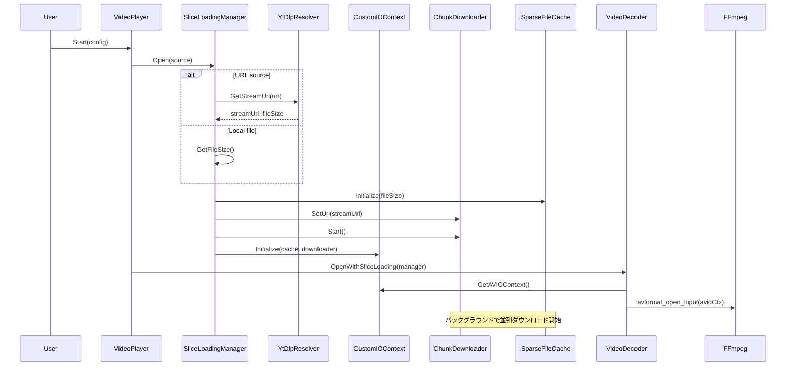
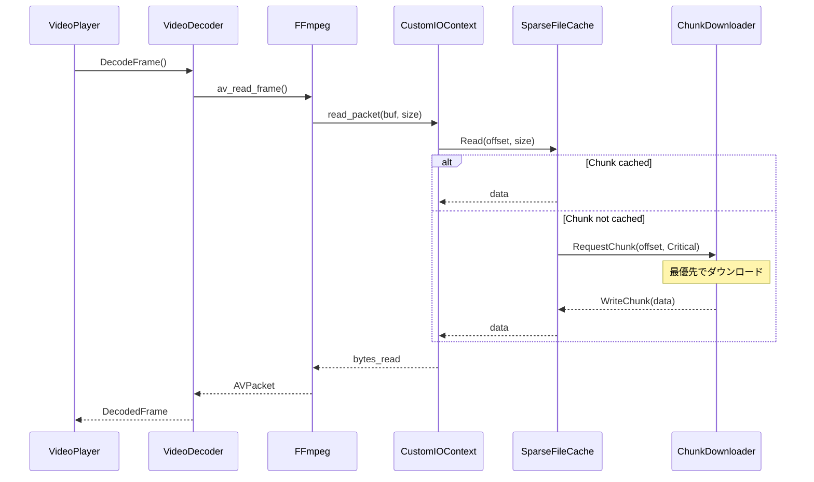

# スライス読み込みアーキテクチャ設計書

## 概要

スライス読み込み（Slice Loading）は、ストリーミング再生とダウンロード再生の折衷案として設計された手法です。

### 目標
- **即時再生**: ストリーミングのように即座に再生開始
- **完全キャッシュ**: ダウンロードのように全チャンクを保存
- **シームレス**: URL→ローカルの切り替えを廃止（常にスライス読み込み）

### 現在の問題点（シームレス切り替え方式）
```
URLストリーミング → バックグラウンドダウンロード → シームレス切り替え
```
- 2つの再生パスを維持する複雑さ
- 切り替え時の同期処理が必要
- FPSの不安定さ（8.6fps→32.6fps→25fps）

### スライス読み込み方式
```
URL解決 → スライス読み込み（CustomIOContext） → 単一再生パス
```
- 再生開始時から全て同じパス
- チャンクが揃えばローカルファイルと同等
- 切り替え不要

---

## コンポーネント構成

```
┌─────────────────────────────────────────────────────────────────────────────┐
│                              VideoPlayer                                      │
│  ┌─────────────────────────────────────────────────────────────────────────┐│
│  │                     SliceLoadingManager（新規）                          ││
│  │  ┌───────────────┐  ┌──────────────────┐  ┌────────────────────────┐   ││
│  │  │ YtDlpResolver │  │ CustomIOContext  │  │ VideoDecoder (FFmpeg)  │   ││
│  │  │               │→ │                  │→ │                        │   ││
│  │  │ URL→Stream    │  │ AVIO Callbacks   │  │ HW Decode (D3D11VA)    │   ││
│  │  └───────────────┘  └────────┬─────────┘  └────────────────────────┘   ││
│  │                              │                                          ││
│  │                     ┌────────▼─────────┐                               ││
│  │                     │  SparseFileCache │                               ││
│  │                     │  ┌─────────────┐ │                               ││
│  │                     │  │ Chunk 0     │ │                               ││
│  │                     │  │ Chunk 1     │ │                               ││
│  │                     │  │ Chunk 2     │ │                               ││
│  │                     │  │ ...         │ │                               ││
│  │                     │  └─────────────┘ │                               ││
│  │                     └────────┬─────────┘                               ││
│  │                              │                                          ││
│  │  ┌───────────────────────────┼────────────────────────────────────┐    ││
│  │  │                           │                                    │    ││
│  │  │ ┌─────────────────────────▼────────────────────────────────┐  │    ││
│  │  │ │                   ChunkDownloader                        │  │    ││
│  │  │ │  ┌─────────┐ ┌─────────┐ ┌─────────┐ ┌─────────┐        │  │    ││
│  │  │ │  │Worker 0 │ │Worker 1 │ │Worker 2 │ │Worker 3 │        │  │    ││
│  │  │ │  └────┬────┘ └────┬────┘ └────┬────┘ └────┬────┘        │  │    ││
│  │  │ │       └───────────┴───────────┴───────────┘              │  │    ││
│  │  │ │                       ↓                                  │  │    ││
│  │  │ │              Priority Queue                              │  │    ││
│  │  │ │  [Critical] → [High] → [Medium] → [Low]                  │  │    ││
│  │  │ └──────────────────────────────────────────────────────────┘  │    ││
│  │  │                                                                │    ││
│  │  │ ┌──────────────────────────────────────────────────────────┐  │    ││
│  │  │ │                  PrefetchScheduler                       │  │    ││
│  │  │ │  Current Position → Priority Calculation → Request       │  │    ││
│  │  │ └──────────────────────────────────────────────────────────┘  │    ││
│  │  └────────────────────────────────────────────────────────────────┘    ││
│  └─────────────────────────────────────────────────────────────────────────┘│
│                                                                              │
│  ┌─────────────────────────────────────────────────────────────────────────┐│
│  │                         Graphics Pipeline                                ││
│  │  FrameConverter → TexturePool → SpoutSender → VJ Software               ││
│  └─────────────────────────────────────────────────────────────────────────┘│
└─────────────────────────────────────────────────────────────────────────────┘
```

---

## 既存コンポーネントの状態

### ✅ 実装済み + 統合済み
| コンポーネント | ファイル | 状態 |
|---------------|---------|------|
| CustomIOContext | `cpp/src/io/CustomIOContext.h/cpp` | 実装済み |
| SparseFileCache | `cpp/src/io/SparseFileCache.h/cpp` | 実装済み |
| ChunkDownloader | `cpp/src/io/ChunkDownloader.h/cpp` | 実装済み |
| PrefetchScheduler | `cpp/src/io/PrefetchScheduler.h/cpp` | 実装済み |
| YtDlpResolver | `cpp/src/ytdlp/YtDlpResolver.h/cpp` | 実装済み |
| VideoDecoder | `cpp/src/decoder/VideoDecoder.h/cpp` | 実装済み |
| VideoPlayer | `cpp/src/player/VideoPlayer.h/cpp` | 実装済み |
| SliceLoadingManager | `cpp/src/io/SliceLoadingManager.h/cpp` | 実装済み |
| VideoDecoder + CustomIOContext | `cpp/src/decoder/VideoDecoder.cpp` | **統合済み (Phase 1)** |
| VideoPlayer + SliceLoadingManager | `cpp/src/player/VideoPlayer.cpp` | **統合済み (Phase 2)** |
| C API 拡張 | `cpp/src/bindings/c_api.cpp` | **統合済み (Phase 3)** |
| Python GUI 統合 | `python/ytdlpspout_native.py` | **統合済み (Phase 4)** |

### 完了済み
- ✅ 全フェーズ統合完了

---

## 統合設計

### 1. PlayerConfig拡張

```cpp
/// @brief プレイヤー設定（拡張版）
struct PlayerConfig {
    // === 入力ソース（いずれか1つを指定） ===
    std::string source;                     // ファイルパス or URL
    
    // === 出力設定 ===
    std::string senderName = "ytdlpSpout";
    int outputWidth = 0;                    // 0=ソース解像度
    int outputHeight = 0;
    
    // === 再生設定 ===
    bool loop = false;
    bool useHardwareAccel = true;
    bool verbose = false;
    
    // === スライス読み込み設定 ===
    struct SliceConfig {
        bool enabled = true;                // スライス読み込み有効
        size_t chunkSize = 1 * 1024 * 1024; // 1MB
        size_t maxCacheMemory = 128 * 1024 * 1024;  // 128MB
        int maxConcurrentDownloads = 4;
        int prefetchChunksAhead = 8;
        std::string cachePath;              // キャッシュ保存先（空=メモリのみ）
    } slice;
    
    // === yt-dlp設定 ===
    struct YtDlpConfig {
        std::string path;                   // yt-dlpパス（空=自動検出）
        int preferredHeight = 1080;         // 希望解像度
        std::string formatSpec;             // カスタムフォーマット指定
    } ytdlp;
};
```

### 2. SliceLoadingManager（新規クラス）

```cpp
/// @brief スライス読み込みマネージャー
/// @details URL/ファイルを統一的に扱うスライス読み込み制御
class SliceLoadingManager {
public:
    SliceLoadingManager();
    ~SliceLoadingManager();
    
    // === 初期化 ===
    
    /// @brief ソースを開く
    /// @param source ファイルパス or URL
    /// @param config スライス設定
    /// @return 成功時true
    bool Open(const std::string& source, const PlayerConfig::SliceConfig& config);
    
    /// @brief クローズ
    void Close();
    
    // === FFmpeg連携 ===
    
    /// @brief AVIOContextを取得
    AVIOContext* GetAVIOContext();
    
    /// @brief ファイルサイズを取得
    int64_t GetFileSize() const;
    
    /// @brief URLか（yt-dlp経由）
    bool IsRemoteSource() const;
    
    // === 再生位置連携 ===
    
    /// @brief 再生位置を更新（プリフェッチ最適化用）
    void UpdatePlaybackPosition(double seconds);
    
    /// @brief シーク通知
    void NotifySeek(double seconds);
    
    // === 統計 ===
    
    /// @brief ダウンロード進捗を取得（0.0〜1.0）
    double GetDownloadProgress() const;
    
    /// @brief 推定帯域幅を取得
    double GetBandwidth() const;
    
    /// @brief 全チャンクがキャッシュ済みか
    bool IsFullyCached() const;
    
private:
    struct Impl;
    std::unique_ptr<Impl> m_impl;
};
```

### 3. VideoDecoder拡張

```cpp
class VideoDecoder {
public:
    // 既存: ファイルパスで開く
    bool Open(const std::string& filePath, ID3D11Device* device);
    
    // 新規: カスタムIOContextで開く
    bool OpenWithCustomIO(
        CustomIOContext* ioContext,
        ID3D11Device* device = nullptr
    );
    
    // 新規: SliceLoadingManagerで開く（推奨）
    bool OpenWithSliceLoading(
        SliceLoadingManager* manager,
        ID3D11Device* device = nullptr
    );
};
```

### 4. VideoPlayer統合

```cpp
bool VideoPlayer::Start(const PlayerConfig& config) {
    // 1. ソースタイプ判定
    SourceType srcType = DetermineSourceType(config.source);
    
    // 2. スライス読み込みマネージャー初期化
    if (config.slice.enabled) {
        m_impl->sliceManager = std::make_unique<SliceLoadingManager>();
        if (!m_impl->sliceManager->Open(config.source, config.slice)) {
            return false;
        }
        
        // デコーダーをカスタムIOで開く
        if (!m_impl->decoder->OpenWithSliceLoading(m_impl->sliceManager.get(), device)) {
            return false;
        }
    } else {
        // 従来のファイルパス直接オープン（ローカルファイルのみ）
        if (!m_impl->decoder->Open(config.source, device)) {
            return false;
        }
    }
    
    // 3. 残りの初期化（既存コード）
    // ...
}

bool VideoPlayer::ProcessFrame() {
    // 再生位置をSliceLoadingManagerに通知（プリフェッチ最適化）
    if (m_impl->sliceManager) {
        m_impl->sliceManager->UpdatePlaybackPosition(GetPlaybackTime());
    }
    
    // 既存のフレーム処理
    // ...
}

bool VideoPlayer::Seek(double seconds) {
    // シークをSliceLoadingManagerに通知
    if (m_impl->sliceManager) {
        m_impl->sliceManager->NotifySeek(seconds);
    }
    
    // 既存のシーク処理
    // ...
}
```

---

## データフロー

### 再生開始フロー



### フレーム読み取りフロー



---

## 優先度管理

### チャンク優先度

```
Priority Level | 説明 | 例
--------------|------|----
Critical (0)  | 即時必要（再生ブロック） | 現在の読み取り位置
High (1)      | 間もなく必要 | 現在位置 + 1-2チャンク
Medium (2)    | 先読み | 現在位置 + 3-8チャンク
Low (3)       | バックグラウンド | 残りのチャンク
```

### プリフェッチ戦略

```cpp
void PrefetchScheduler::UpdatePlaybackPosition(int64_t byteOffset) {
    int64_t currentChunk = byteOffset / chunkSize;
    
    // Critical: 現在のチャンク
    RequestChunk(currentChunk, ChunkPriority::Critical);
    
    // High: 次の2チャンク
    for (int i = 1; i <= 2; i++) {
        if (currentChunk + i < totalChunks) {
            RequestChunk(currentChunk + i, ChunkPriority::High);
        }
    }
    
    // Medium: 3-8チャンク先
    for (int i = 3; i <= 8; i++) {
        if (currentChunk + i < totalChunks) {
            RequestChunk(currentChunk + i, ChunkPriority::Medium);
        }
    }
    
    // Low: アイドル時に残りをダウンロード
    ScheduleBackgroundDownload();
}
```

---

## キャッシュ永続化（オプション）

### メモリキャッシュ → ファイルキャッシュ

```cpp
struct SliceConfig {
    std::string cachePath;  // 空=メモリのみ、指定=ファイルに保存
    bool persistCache = false;  // true=再生終了後もキャッシュ保持
};
```

### キャッシュファイル形式

```
cache/
├── {video_id}/
│   ├── metadata.json     # ファイルサイズ、チャンク数等
│   ├── chunk_0000.bin    # チャンクデータ
│   ├── chunk_0001.bin
│   └── ...
```

全チャンクが揃った場合、結合して元の動画ファイルとして保存可能。

---

## C API拡張

```cpp
// スライス読み込み設定
typedef struct {
    int enabled;
    size_t chunk_size;
    size_t max_cache_memory;
    int max_concurrent_downloads;
    int prefetch_chunks_ahead;
    const char* cache_path;
} ytdlpspout_slice_config;

// 拡張開始関数
YTDLPSPOUT_API int ytdlpspout_start_ex(
    ytdlpspout_handle handle,
    const char* source,                    // ファイルパス or URL
    const char* sender_name,
    int output_width,
    int output_height,
    int loop,
    int use_hardware_accel,
    int verbose,
    const ytdlpspout_slice_config* slice_config  // NULL=デフォルト
);

// 統計取得
YTDLPSPOUT_API double ytdlpspout_get_download_progress(ytdlpspout_handle handle);
YTDLPSPOUT_API double ytdlpspout_get_bandwidth(ytdlpspout_handle handle);
YTDLPSPOUT_API int ytdlpspout_is_fully_cached(ytdlpspout_handle handle);
```

---

## 実装フェーズ

### Phase 1: VideoDecoder + CustomIOContext統合 ✅ **完了**
1. ✅ VideoDecoder::OpenWithCustomIO() 実装
2. ✅ CustomIOContext → AVFormatContext 接続
3. ✅ ユニットテスト (`test_decoder_custom_io.cpp`)

### Phase 2: SliceLoadingManager実装 ✅ **完了**
1. ✅ SliceLoadingManager クラス作成 (`cpp/src/io/SliceLoadingManager.h/cpp`)
2. ✅ YtDlpResolver統合（URL解決）
3. ✅ VideoPlayer統合（PlayerConfig拡張、SliceConfig/YtDlpConfig追加）
4. ✅ ユニットテスト (`test_slice_loading_manager.cpp` - 9テスト全て通過)

### Phase 3: C API拡張 ✅ **完了**
1. ✅ `ytdlpspout_config_ex_init()` 実装 - デフォルト設定初期化
2. ✅ `ytdlpspout_start_ex()` 実装 - 拡張設定で再生開始
3. ✅ 統計API実装:
   - `ytdlpspout_get_download_progress()` - ダウンロード進捗
   - `ytdlpspout_get_bandwidth()` - 帯域幅
   - `ytdlpspout_is_fully_cached()` - 完全キャッシュ判定
   - `ytdlpspout_get_cache_stats()` - キャッシュ統計
4. ✅ ユニットテスト (`test_c_api.cpp` - 41テスト、73アサーション全て通過)

#### 追加された構造体
```c
// スライス読み込み設定
YtdlpSpoutSliceConfig {
    int enabled;              // 有効フラグ
    size_t chunkSize;         // チャンクサイズ (1MB)
    size_t maxCacheMemory;    // キャッシュメモリ (128MB)
    int maxConcurrentDownloads; // 並列数 (4)
    int prefetchChunksAhead;  // 先読み数 (8)
    const char* cachePath;    // ファイルキャッシュパス
}

// yt-dlp設定
YtdlpSpoutYtDlpConfig {
    const char* path;         // yt-dlpパス
    int preferredHeight;      // 希望解像度 (1080)
}

// 拡張設定
YtdlpSpoutConfigEx {
    const char* source;       // ソース
    const char* senderName;   // Sender名
    int outputWidth/Height;   // 出力サイズ
    int loop/useHardwareAccel/verbose;
    YtdlpSpoutSliceConfig slice;
    YtdlpSpoutYtDlpConfig ytdlp;
}
```

### Phase 4: Python GUI統合 ✅ 完了
1. `python/ytdlpspout_native.py` - 拡張構造体とAPI追加
   - `YtdlpSpoutSliceConfig` 構造体
   - `YtdlpSpoutYtDlpConfig` 構造体
   - `YtdlpSpoutConfigEx` 構造体
   - `start_ex()` メソッド
   - `download_progress` / `bandwidth` / `is_fully_cached` プロパティ
   - `get_cache_stats()` メソッド
2. `python/native_streamer_wrapper.py` - プロパティ追加
   - `download_progress` プロパティ
   - `is_fully_cached` プロパティ
   - `bandwidth` プロパティ（推定帯域幅 bytes/sec）
3. `gui.py` - 進捗表示機能追加
   - `_update_native_progress()` - NativeStreamerWrapperの進捗を取得・表示
   - `show_native_progress()` - 進捗バー表示
   - 帯域幅のフォーマット表示（MB/s, KB/s, B/s）
   - キャッシュ完了時は進捗バー非表示
4. Legacy seamless switchingコード削除
   - `_switching_in_progress`, `_switching_cancelled` 等の変数を削除
   - `_cancel_switching()` メソッドを削除
   - `switch_to_local_file()` を簡略版に置換

### Phase 5: Python側非同期URL解決 ✅ 完了
**目標**: yt-dlp URL再生時の「Start」ボタン押下後、即座に再生開始

1. `python/ytdlp_resolver.py` - 非同期URL解決モジュール（新規作成）
   - `ResolvedInfo` データクラス: 解決済みストリーム情報を保持
     - `stream_url`: 直接ストリームURL
     - `duration`, `width`, `height`, `title`: 動画メタデータ
     - `http_headers`: HTTPヘッダー（Cookie含む）
   - `YtDlpAsyncResolver` クラス:
     - `is_ytdlp_url(url)`: yt-dlp対応URLかどうか判定（静的メソッド）
     - `resolve_async(url)`: 非同期でURL解決（Future返却）
     - `resolve_sync(url)`: 同期でURL解決
     - `cancel()`: 進行中の解決をキャンセル
     - `shutdown()`: リソースクリーンアップ

2. `python/native_streamer_wrapper.py` - 修正
   - `__init__()` に `pre_resolved_url` 引数追加
   - `_run()` で `pre_resolved_url` があれば直接使用

3. `gui.py` - 修正
   - `YtDlpAsyncResolver` インポート追加
   - `_ytdlp_resolver` / `_url_resolving` 状態変数追加
   - `_start_url_stream()` を修正:
     - yt-dlp URLかどうか判定
     - yt-dlp URL: 非同期でURL解決 → 解決済みURLでストリーマー作成
     - 直接URL/ローカルファイル: 即座にストリーマー作成
   - `_start_url_stream_with_resolver()`: 非同期URL解決フロー
   - `_start_url_stream_direct()`: 従来の直接URL処理

4. テスト追加
   - `python/test_ytdlp_resolver.py` - 19テスト
   - `python/test_native_streamer_wrapper.py` - pre_resolved_url テスト追加
   - `tests/test_gui_native_progress.py` - YtDlpResolver統合テスト追加

**yt-dlp対応ドメイン一覧**:
- YouTube, Twitch, ニコニコ動画, Vimeo, Dailymotion, Bilibili
- Twitter/X, Instagram, TikTok, Facebook
- SoundCloud, Bandcamp, Reddit

**処理フロー**:
```
[yt-dlp URL入力]
    │
    ▼
[is_ytdlp_url() 判定]
    │
    ├── Yes: [非同期URL解決開始]
    │           │
    │           ▼
    │        [解決完了を待機 (ポーリング)]
    │           │
    │           ▼
    │        [解決済みURLでストリーマー作成]
    │        (pre_resolved_url 引数使用)
    │
    └── No: [直接URLでストリーマー作成]
              (従来の処理)
```

---

## 期待される効果

| 指標 | 現在 | スライス読み込み後 |
|-----|------|-------------------|
| 再生開始時間 | 即時（ストリーミング） | 即時 |
| FPS安定性 | 不安定（8.6→32.6→25） | 安定（25fps一定） |
| 切り替え処理 | 必要 | 不要 |
| コードパス | 2つ（URL/ローカル） | 1つ |
| キャッシュ | なし | 全チャンク保持 |
| シーク応答性 | 遅い（再ダウンロード） | 高速（キャッシュ活用） |
